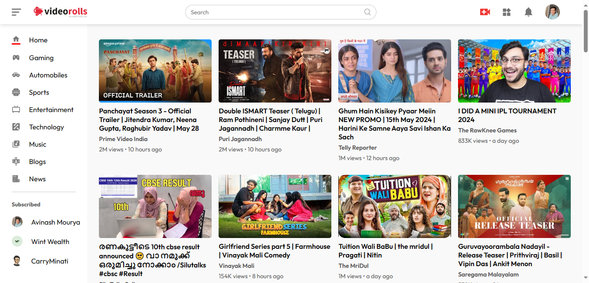
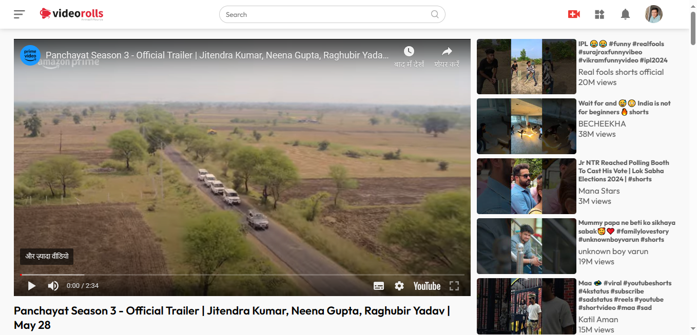

# YouTube Clone Dev with React.js

Welcome to the YouTube Clone project! This project is a YouTube-like web application built using React.js. It allows users to search for videos, view video details, and browse through various categories.

## Features

- **Search Videos**: Users can search for videos by keywords.
- **Video Details**: View detailed information about a selected video, including the title, description, and view count.
- **Related Videos**: Browse through related videos for each selected video.
- **Categories**: Explore videos based on different categories.
- **Responsive Design**: The application is fully responsive and works on different screen sizes.

## Technologies Used

- **React.js**: A JavaScript library for building user interfaces.
- **React Router**: For handling navigation and routing within the application.
- **Moment.js**: For parsing, validating, manipulating, and displaying dates and times.
- **YouTube Data API**: Provides access to YouTube data such as videos, playlists, and channels.

## Setup Instructions

To run this project locally, follow these steps:

1. **Clone the repository**:
    ```sh
    git clone https://github.com/yourusername/youtube-clone.git
    cd youtube-clone
    ```

2. **Install dependencies**:
    ```sh
    npm install
    ```

3. **Set your YouTube Data API key**:
    - Open `src/data.js` file.
    - Replace the placeholder API key with your YouTube Data API key.
    
    ```javascript
    export const API_KEY = 'YOUR_YOUTUBE_API_KEY';
    ```

4. **Run the application**:
    ```sh
    npm run dev
    ```

The application will be available at `http://localhost:5173`.

## Project Structure

- **/src**: Contains all the source code for the application.
  - **/components**: Reusable React components.
  - **/pages**: Components representing different pages (e.g., Home, VideoDetail).
  - **/services**: Modules for making API requests.
  - **App.js**: Main application component.
  - **index.js**: Entry point of the React application.

## Contributing

Contributions are welcome! If you have any suggestions or find a bug, please open an issue or create a pull request.

1. Fork the repository.
2. Create a new branch (`git checkout -b feature-branch`).
3. Make your changes.
4. Commit your changes (`git commit -m 'Add some feature'`).
5. Push to the branch (`git push origin feature-branch`).
6. Open a pull request.

## Acknowledgements

- [React.js](https://reactjs.org/)
- [React Router](https://reactrouter.com/)
- [Moment.js](https://momentjs.com/)
- [YouTube Data API](https://developers.google.com/youtube/v3)

Feel free to explore, use, and contribute to this project. Happy coding! 🚀

## Project Images



